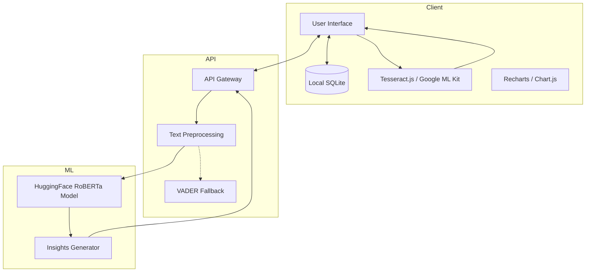

# 🧠 ReflectAI: Daily Journal & Mood Visualizer

[](https://reactnative.dev/)
[](https://fastapi.tiangolo.com/)
[](https://huggingface.co/)
[](https://www.docker.com/)
[](https://opensource.org/licenses/MIT)

**ReflectAI** is a privacy-first, AI-powered daily journal application. It seamlessly blends traditional journaling (text and handwritten notes via OCR) with state-of-the-art Natural Language Processing (NLP) to classify your mood, visualize emotional trends over time, and provide personalized self-improvement insights.

---

## 🚀 Features

- **Dual Journaling Modes:**
  - *Structured Mode:* Guided prompts (default for new users) to help overcome writer's block
  - *Unstructured Mode:* Free-form text for natural thought flow
- **Smart OCR Integration:** Scan handwritten or printed diary pages; automatically converts to digital text
- **Advanced Sentiment Analysis:** Classifies daily entries into granular moods (Happy, Sad, Stressed, Neutral, Anxious) using HuggingFace Transformers
- **Data Visualization:** Interactive Weekly/Monthly mood tracking using beautiful Pie and Bar charts
- **Actionable Insights:** AI-generated self-improvement suggestions based on longitudinal emotional trends
- **Privacy-First Architecture:** Anonymous usage, local-first storage (SQLite/Encrypted), and stateless AI API

---

## 🏛️ System Architecture

The system utilizes a decoupled frontend-backend architecture to ensure mobile performance while offloading heavy ML processing to a scalable Python backend.



---

## 📂 Project Structure

```
reflectai/
├── frontend/                  # React Native (or React Web) app
│   ├── src/
│   │   ├── components/        # Reusable UI
│   │   ├── screens/           # Main views
│   │   ├── services/          # API calls & OCR logic
│   │   ├── utils/             # Helpers
│   │   └── App.js
│   ├── package.json
│   └── .env
├── backend/                   # FastAPI backend
│   ├── app/
│   │   ├── api/               # API routes
│   │   ├── core/              # Config, Security
│   │   ├── models/            # Pydantic schemas
│   │   ├── services/          # NLP, Sentiment, Insights
│   │   └── main.py
│   ├── requirements.txt
│   ├── Dockerfile
│   └── .env
├── docker-compose.yml
└── README.md
```

---

## ⚙️ Setup Instructions

### Prerequisites
- Node.js (v18+)
- Python (v3.10+)
- Docker & Docker Compose (optional)

### Backend Setup

```bash
cd backend
python -m venv venv
source venv/bin/activate  # On Windows: .\venv\Scripts\activate
pip install -r requirements.txt
uvicorn app.main:app --reload --port 8000
```

### Frontend Setup

```bash
cd frontend
npm install
npm start  # or: npm run web / ios / android
```

---

## 🔐 Environment Variables

**Backend (`backend/.env`):**
```
ENVIRONMENT=development
API_KEY_SECRET=super_secret_key_123
HUGGINGFACE_TOKEN=hf_xxx
CORS_ORIGINS=http://localhost:3000
```

**Frontend (`frontend/.env`):**
```
REACT_APP_API_URL=http://localhost:8000
REACT_APP_ENCRYPTION_KEY=local_db_secret_key
```

---

## 🌐 API Endpoints

| Method | Endpoint | Description | Payload | Response |
|--------|----------|-------------|---------|----------|
| `POST` | `/api/v1/analyze` | Sentiment analysis | `{"text": "..."}` | `{"mood": "happy", "confidence": 0.94}` |
| `POST` | `/api/v1/insights` | Weekly suggestions | `{"moods": [...]}` | `{"suggestion": "..."}` |
| `GET` | `/health` | Health check | None | `{"status": "ok"}` |

---

## 🧠 ML Model Pipeline

```
[User Input / OCR Scan]
        ↓
[Text Preprocessing]
  - PII masking (NER)
  - Normalize text
        ↓
[HuggingFace RoBERTa]
  model: j-hartmann/emotion-english-distilroberta-base
        ↓  (fallback if needed)
  [VADER Heuristic]
        ↓
[Mood Score + Insights]
        ↓
[JSON → Frontend → Charts]
```

---

## 🏃 Hackathon Sprint Breakdown

### Sprint 1 — Day 1 Morning
- [ ] Initialize React Native frontend
- [ ] Setup local SQLite with CRUD operations
- [ ] Implement structured vs. unstructured UI

### Sprint 2 — Day 1 Afternoon
- [ ] Integrate Tesseract.js / Google ML Kit for OCR
- [ ] Initialize FastAPI backend
- [ ] Setup `/analyze` endpoint with VADER

### Sprint 3 — Day 2 Morning
- [ ] Replace VADER with HuggingFace RoBERTa
- [ ] Build Recharts components for mood visualization

### Sprint 4 — Day 2 Afternoon
- [ ] Implement Insights generation
- [ ] Dockerize backend
- [ ] Deploy to Vercel + Render
- [ ] Record demo video

---

## 🐳 Docker Setup

```bash
docker-compose up --build
```

**docker-compose.yml:**
```yaml
version: '3.8'
services:
  backend:
    build: ./backend
    ports:
      - "8000:8000"
    environment:
      - ENVIRONMENT=development

  frontend:
    build: ./frontend
    ports:
      - "3000:3000"
    environment:
      - REACT_APP_API_URL=http://localhost:8000
    depends_on:
      - backend
```

---

## 🚀 Deployment

### Backend → Render
1. Push code to GitHub
2. New Web Service → connect repo
3. Root Directory: `backend`
4. Build: `pip install -r requirements.txt`
5. Start: `uvicorn app.main:app --host 0.0.0.0 --port $PORT`

### Frontend → Vercel
1. Import GitHub repo
2. Framework: Create React App
3. Root Directory: `frontend`
4. Build: `npm run build`
5. Add env: `REACT_APP_API_URL`

---

## 🧪 Testing Strategy

- **Backend:** `pytest` for unit tests
- **Frontend:** `Jest` + `React Testing Library`
- **E2E:** `Cypress` for full user flow testing

---

## 🔮 Future Roadmap

- [ ] Voice Journaling (Whisper API)
- [ ] RAG-based AI Therapist chatbot
- [ ] Cloud-sync with E2E encryption
- [ ] Wearable integration (Apple Watch / Fitbit)

---

## 🤝 Contributing

1. Fork the Project
2. Create your Feature Branch (`git checkout -b feature/AmazingFeature`)
3. Commit your Changes (`git commit -m 'Add some AmazingFeature'`)
4. Push to the Branch (`git push origin feature/AmazingFeature`)
5. Open a Pull Request

---

## 📄 License

Distributed under the MIT License. See `LICENSE` for more information.

---

## 👨‍💻 Author

**Mayank** - AI/ML Researcher & Software Engineer  
📍 Bangalore, India  
🔗 [GitHub](https://github.com/mayankbot01)  

---

**Built with ❤️ using FastAPI, React Native, and HuggingFace Transformers**
